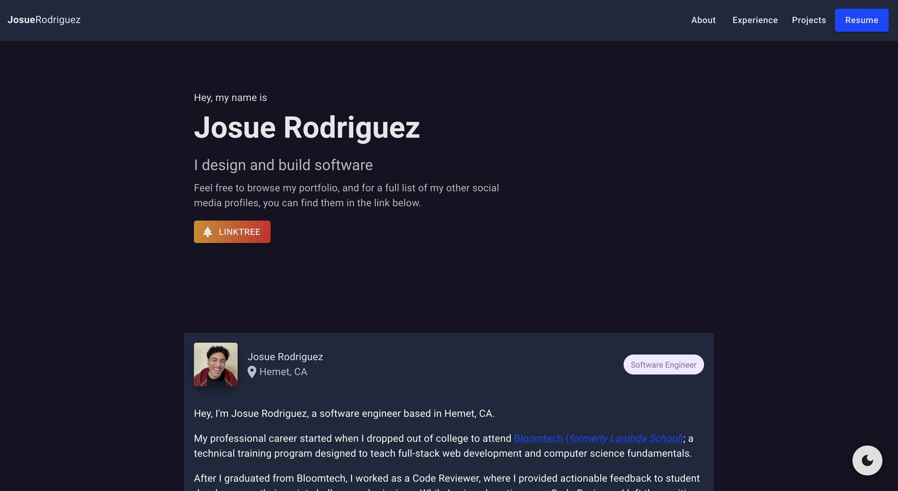

# Portfolio

Compilation of materials that exemplifies skills, qualifications, education, training, and experiences.

# Tech/Frameworks

[React](https://reactjs.org/) | [Material-UI](https://mui.com/)

# Packages

[React-scroll](https://www.npmjs.com/package/react-scroll) | [React-slick](https://www.npmjs.com/package/react-slick) | [React-router](https://www.npmjs.com/package/react-router)

# Design

[UI/UX Design Files](https://www.figma.com/file/GmaljsSK6QxdSEPWCUxeGY/Portfolio?node-id=0%3A1)

# Screenshots

### Light


### Dark



# Installation

1. Install dependencies

   ```
   npm install
   ```

2. Start development server

   ```
   npm start
   ```
